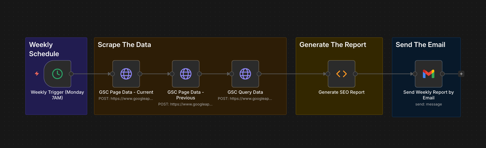

# n8n Growth Engine SEO Report

    
    +

Hi everyone.

I built this workflow because I faced a frustrating problem with the Google Search Console API. As you might know, when you request the "query" dimension from the API, Google filters out "anonymized queries" (long-tail keywords) for privacy reasons.

This results in a huge data discrepancy. You might see 100 clicks in the GSC interface, but the API only gives you 20 clicks because the rest are hidden behind that privacy filter.

As a Growth Engineer, I need accurate data to make decisions. So, I created this n8n workflow to bypass that limitation and generate actionable reports.

## How it works

The logic is simple but effective. Instead of making one API call, we make three separate calls to gather all necessary data points without loss:

1.  **Page Data (Current & Previous):** We fetch data using only the "page" dimension. This forces Google to send us 100% accurate click and impression totals, without hiding anything.
2.  **Query Data:** We fetch the query details separately to find opportunities and keyword cannibalization issues.
3.  **The Merger:** A custom JavaScript node merges these datasets. It gives us the precise traffic numbers from step 1, combined with the actionable keyword insights from step 2.

The result is a weekly HTML email report that shows exactly what is happening with your SEO performance, down to the last click.

## Important: You need to edit the code

I cleaned up the code to make it safe for GitHub, removing my own domain and brand details. Before you run this, you need to open the "Generate Report" Code Node in n8n and update the settings section at the top.

Here is what you must change:

* **URL_WHITELIST:** I put some placeholder regex patterns here. Replace them with the specific page paths you want to track closely (like /blog/, /features/, etc.).
* **ignoreQueryTerms:** Change 'your_brand' to your actual brand name. This filters out branded searches so you can focus on non-brand growth efforts.
* **ignoreHomepage:** If set to true, it removes the homepage traffic from the report analysis. Change this if you want to include it.
* **cleanUrl function:** Look for 'yourdomain.com' inside the code boundaries and replace it with your actual website domain. This ensures the links in the email report look clean and professional.

## Features

* **Accurate Data:** Solves the GSC data sampling issue by separating page and query requests.
* **Cannibalization Detection:** Identifies multiple pages that are fighting for ranking on the same keywords.
* **Low Hanging Fruits:** Highlights keywords ranking between positions 10-20 that have high impression volumes.
* **Content Decay:** Spots pages that are currently losing both traffic and rankings, so you can update them before it is too late.
* **Clean Report:** Sends a mobile-responsive, futuristic-looking HTML email summary.

## How to use

1.  Import the JSON file into your n8n instance.
2.  Set up your Google Search Console credentials in the three HTTP Request nodes.
3.  Edit the Code Node configuration as mentioned above.
4.  Connect your email provider node (Gmail, Outlook, SMTP, etc.) to the final output.
5.  Set the Schedule Trigger to run weekly (I prefer Monday mornings).

I hope this tool helps you uncover better insights and grow your organic traffic. Feel free to fork it or suggest improvements.

Cheers.
